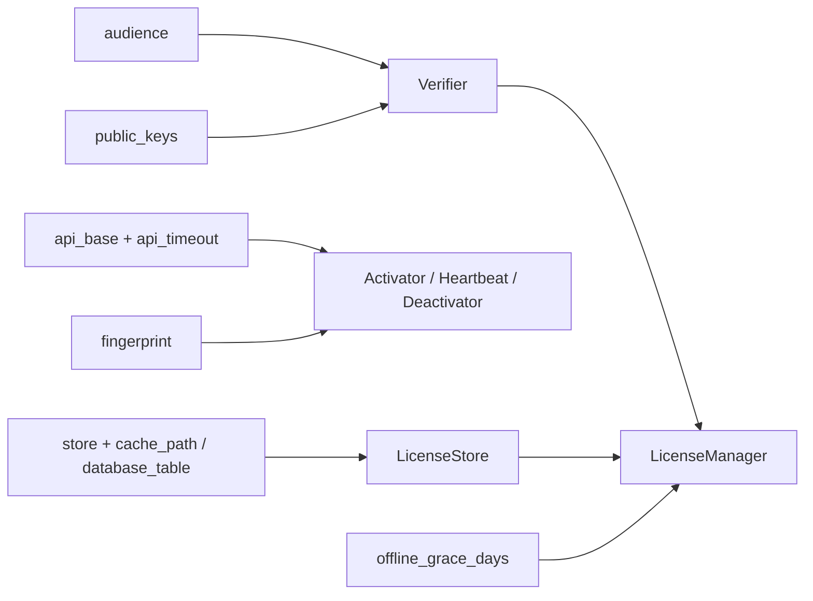

# Configuration

Walk-through of `config/g8key-client.php`.

## Default contents

```php
return [
    'audience'           => env('G8KEY_AUDIENCE', 'g8stack'),
    'api_base'           => env('G8KEY_API_BASE', 'https://g8key.devhub.my'),
    'api_timeout'        => env('G8KEY_API_TIMEOUT', 10),
    'public_keys'        => [
        // 'g8stack-2026-04' => env('G8STACK_LICENSE_PUBLIC_KEY_G8STACK_2026_04'),
    ],
    'store'              => env('G8KEY_STORE', 'file'),
    'cache_path'         => storage_path('app/license.json'),
    'database_table'     => 'g8key_licenses',
    'offline_grace_days' => env('G8KEY_OFFLINE_GRACE_DAYS', 7),
    'fingerprint'        => null,
];
```

## Field reference

| Field | Type | Purpose |
|-------|------|---------|
| `audience` | string | Product slug. Must match the `aud` claim in the token. |
| `api_base` | string | Base URL of the G8Key server. |
| `api_timeout` | int | HTTP timeout in seconds for activate/heartbeat/deactivate calls. |
| `public_keys` | array | Map of `kid` → base64-encoded EdDSA public key. Multiple kids may coexist during rotation. |
| `store` | `file` \| `database` | Where activation state is persisted. |
| `cache_path` | string | File path used when `store = file`. |
| `database_table` | string | Table name used when `store = database`. |
| `offline_grace_days` | int | Maximum days the cached token is honoured after a successful heartbeat. |
| `fingerprint` | callable\|null | Override the default machine-fingerprint generator. |

## Where each field lands



## Next Steps

- [Public Keys](../04-configuration/02-public-keys.md) — managing the kid → key map
- [Stores](../04-configuration/03-stores.md) — file vs database trade-offs
- [Key Rotation](../05-operations/01-key-rotation.md) — operator runbook for swapping keys
