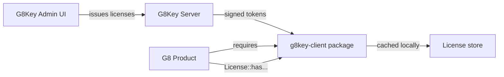

# Overview

The package within the G8Suite licensing model.

## The model

Three actors:

- **G8Key server** — issues licenses and signs short-lived tokens with EdDSA.
- **g8key-client** — this package; verifies tokens offline, manages activation cache, and exposes entitlements.
- **G8 product** (G8Stack, G8ID, …) — installs the package, configures audience and public keys, and consumes
  `License::has(...)` for feature gating.

## Why a single shared package

Each product needs the same verifier, the same activation flow, the same heartbeat, the same middleware. Copy-pasting
that into 15 products is unmaintainable; a single package makes:

- Bug fixes in the verifier land everywhere at once
- Console-command UX consistent across products
- Key rotation a uniform `.env` update

See [ADR-0001: Package vs Inline](../07-decisions/01-package-vs-inline.md) for the full reasoning.

## What the package does NOT do

- It does not issue tokens.
- It does not store private keys.
- It does not contact the server on every request — only at activation and during the scheduled heartbeat.
- It does not assume a multi-tenant licensing model. One license per product instance.

## Next Steps

- [Package Layout](02-package-layout.md)
- [Token Format](03-token-format.md)
- [Data Flow](04-data-flow.md)
