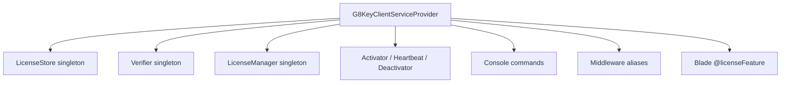

# Package Layout

Directory and class map.

## Source tree (target)

```text
src/
├── G8KeyClientServiceProvider.php
├── LicenseManager.php
├── Contracts/
│   ├── LicenseStore.php
│   └── TokenVerifier.php
├── Exceptions/
│   ├── G8KeyClientException.php
│   ├── MalformedTokenException.php
│   ├── AlgConfusionException.php
│   ├── UnknownKidException.php
│   ├── InvalidSignatureException.php
│   ├── AudienceMismatchException.php
│   ├── TokenExpiredException.php
│   ├── ActivationFailedException.php
│   ├── HeartbeatFailedException.php
│   ├── LicenseRevokedException.php
│   ├── LicenseSuspendedException.php
│   └── NotActivatedException.php
├── Services/
│   ├── Verifier.php
│   ├── Activator.php
│   ├── Heartbeat.php
│   └── Deactivator.php
├── Stores/
│   ├── FileLicenseStore.php
│   └── DatabaseLicenseStore.php
├── Console/
│   ├── ActivateCommand.php
│   ├── HeartbeatCommand.php
│   ├── DeactivateCommand.php
│   └── StatusCommand.php
├── Http/
│   └── Middleware/
│       ├── RequireLicense.php
│       └── RequireFeature.php
└── Facades/
    └── License.php
```

## Class responsibilities

| Class | Responsibility |
|-------|----------------|
| `LicenseManager` | The binding behind `License::*`. Reads cached token, runs the verifier once per request, exposes entitlement helpers. |
| `Verifier` | Pure-PHP EdDSA token verification. Mirrors the server-side verifier exactly. |
| `Activator` / `Heartbeat` / `Deactivator` | HTTP clients for the three G8Key endpoints. Each persists state to the store on success. |
| `LicenseStore` (`FileLicenseStore` / `DatabaseLicenseStore`) | Persists `{ activation_uuid, token, status, last_heartbeat_at }`. |
| `RequireLicense` / `RequireFeature` | Route middleware. 403 if the manager reports invalid or feature missing. |
| `License` facade | Static convenience surface. |

## Service-provider wiring



The store driver is selected from `config('g8key-client.store')`. Manager depends on store + verifier.

## Next Steps

- [Token Format](03-token-format.md)
- [Data Flow](04-data-flow.md)
- [Implementation Plan](../06-development/01-implementation-plan.md) — the build sheet that produces this layout
