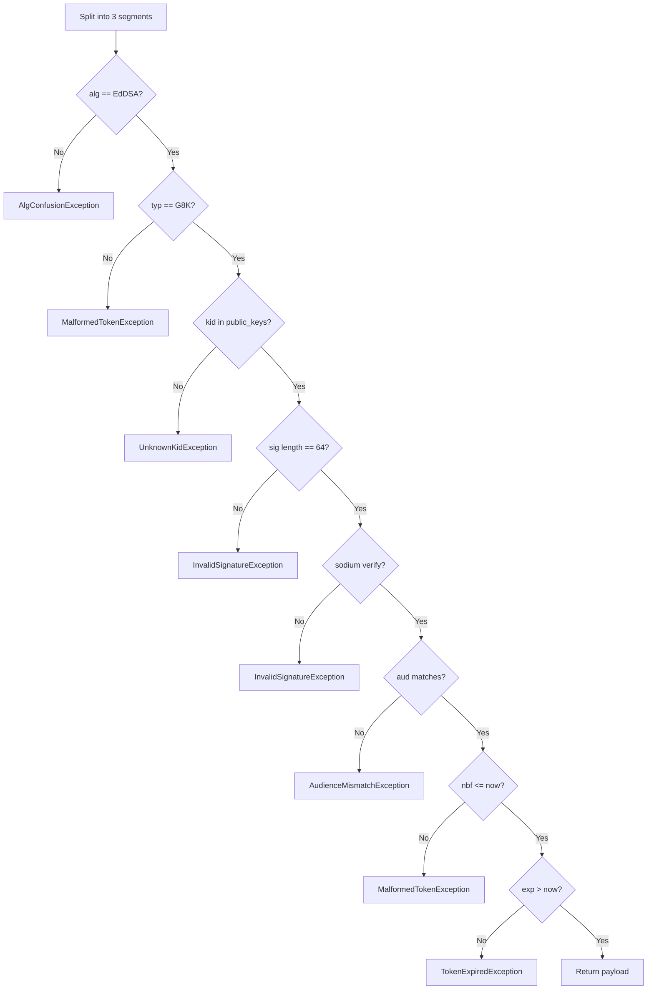

# Token Format

The wire format the verifier checks. Authoritative spec lives in the
[G8Key server docs](https://github.com/developers-hub-my/g8key-app/blob/main/docs/06-g8key/02-token-format.md);
this page summarises what the client must enforce.

## Shape

A token is three base64url-encoded segments joined by `.`:

```text
header.payload.signature
```

## Header

```json
{
  "alg": "EdDSA",
  "typ": "G8K",
  "kid": "g8stack-2026-04"
}
```

| Field | Allowed | Reason |
|-------|---------|--------|
| `alg` | `EdDSA` only | Reject any other algorithm before touching crypto (alg-confusion guard). |
| `typ` | `G8K` only | Distinguish from generic JWTs. |
| `kid` | string | Selects which public key in the configured map to verify with. |

## Payload

```json
{
  "iss": "lic.g8suite.com",
  "sub": "01HZ...",
  "aud": "g8stack",
  "customer": "01HZ...",
  "tier": "pro",
  "seats": 5,
  "features": ["sso", "audit_log"],
  "iat": 1714400000,
  "nbf": 1714400000,
  "exp": 1714486400,
  "grace_days": 7,
  "fingerprint": "sha256:..."
}
```

| Field | Type | Validated |
|-------|------|-----------|
| `iss` | string | Informational. |
| `sub` | string | License UUID. Informational on the client. |
| `aud` | string | Must equal configured `audience`. |
| `customer` | string | Customer UUID. Read by `License::customer()` for telemetry / display. |
| `tier` | string | Read by `License::tier()`. |
| `seats` | int | Total seats on the license. Read by `License::seats()`. |
| `features` | string[] | Read by `License::has()` and `License::features()`. |
| `nbf` | int (epoch) | `nbf <= now`. |
| `exp` | int (epoch) | `exp > now`, with offline grace handled by `LicenseManager`. |
| `grace_days` | int | Soft-expiry tolerance the SDK applies after `exp`. Read by `License::graceDays()`. |
| `fingerprint` | string | Activation fingerprint this token is bound to. Read by `License::fingerprint()`. |

`seats_used` is reserved — when the server starts emitting it, `License::seatsRemaining()` returns `seats - seats_used`
without any client change.

## Signature

EdDSA over `base64url(header) + "." + base64url(payload)`. The decoded signature must be exactly
`SODIUM_CRYPTO_SIGN_BYTES` (64 bytes). Anything else fails the length guard before hitting
`sodium_crypto_sign_verify_detached`.

## Validation order



The order matters. Cheap header checks come before crypto. Format guards come before signature verification.
This is identical to the server-side verifier — that is not duplication, it is the contract.

## Next Steps

- [Data Flow](04-data-flow.md)
- [Implementation Plan](../06-development/01-implementation-plan.md)
