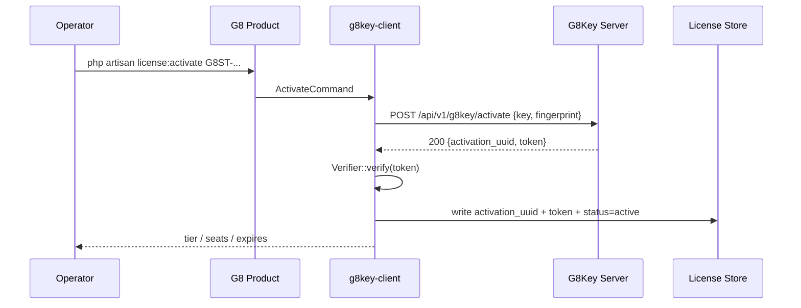
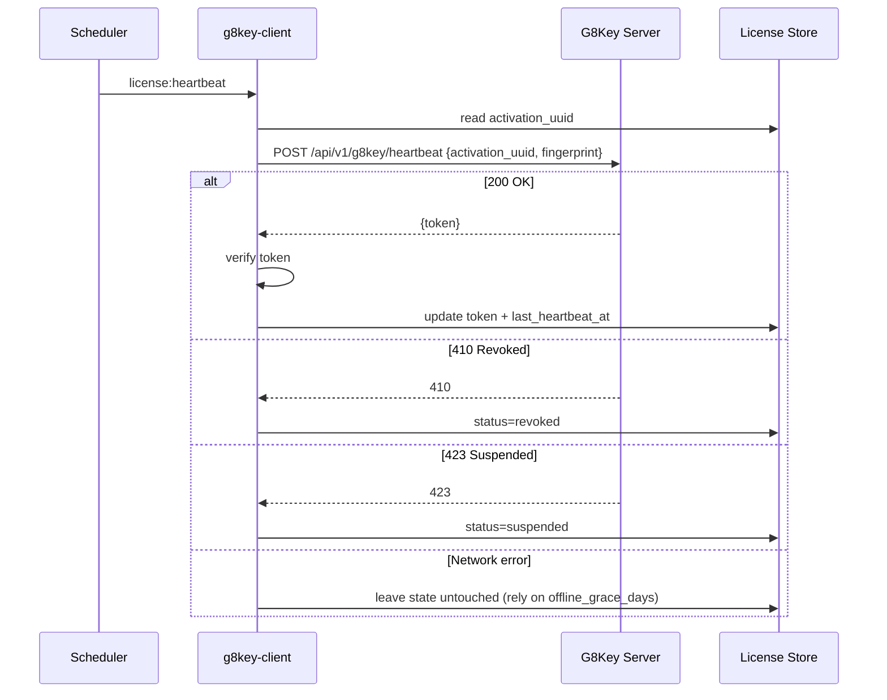
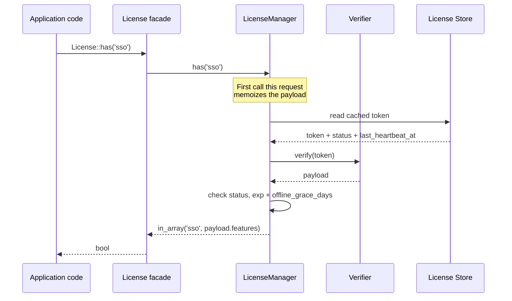

# Data Flow

End-to-end sequences for the three flows that matter.

## Activation

Failure modes:

- Network down → `ActivationFailedException`. No partial state written.
- Wrong audience or unknown kid in returned token → `AudienceMismatchException` / `UnknownKidException`. Indicates the
  product is configured against the wrong public key.

## Heartbeat (daily)

Network failures do not flip status. Only an authoritative `410` / `423` from the server does.

## Entitlement check (hot path)

`LicenseManager` memoizes the verified payload for the duration of the request, so repeated `License::*` calls on the
same request do not re-verify.

## Next Steps

- [Activation walkthrough](../03-integration/01-activation.md)
- [Heartbeat scheduling](../03-integration/02-heartbeat.md)
- [Entitlement patterns](../03-integration/03-entitlements.md)
