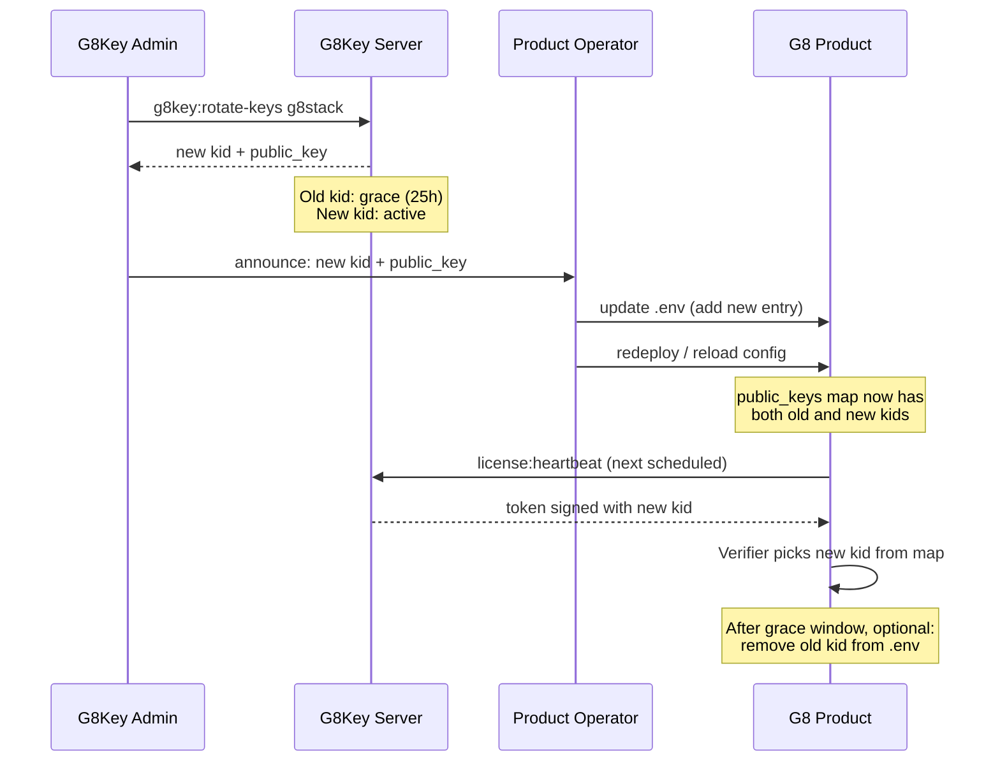

# Key Rotation

Operator procedure for handling a key rotation announced by the G8Key admin.

## Why rotation happens

Signing keys rotate on a schedule (typically quarterly) or in response to a suspected compromise. The G8Key admin
generates a new keypair, marks it active, and the previous key enters a 25-hour grace window (token TTL + 1 hour
buffer).

## The flow



## Step-by-step

1. **Receive the new key**. The G8Key admin sends `kid` + `public_key` (or you read it from the admin UI).
2. **Add to `.env`**. Append the new entry alongside the existing one — do not replace yet.

   ```env
   # current active key, in grace
   G8STACK_LICENSE_PUBLIC_KEY_G8STACK_2026_04=<old base64>

   # new active key
   G8STACK_LICENSE_PUBLIC_KEY_G8STACK_2026_07=<new base64>
   ```

3. **Update `config/g8key-client.php`**. Make sure both entries are referenced:

   ```php
   'public_keys' => [
       'g8stack-2026-04' => env('G8STACK_LICENSE_PUBLIC_KEY_G8STACK_2026_04'),
       'g8stack-2026-07' => env('G8STACK_LICENSE_PUBLIC_KEY_G8STACK_2026_07'),
   ],
   ```

4. **Reload config** (deploy the env update; restart workers / FPM as your platform requires).
5. **Verify**. Run the heartbeat manually:

   ```bash
   php artisan license:heartbeat
   php artisan license:status
   ```

   The status output should still report `active` and the cached token's header should now show the new kid.

6. **Optional cleanup**. After 25 hours (the documented grace window), remove the old `kid` entry from `.env` and the
   config map. Leaving it does no harm except for a cluttered config.

## Common mistakes

| Mistake | Consequence |
|---------|-------------|
| Replacing the old kid before grace expires | Older tokens fail with `UnknownKidException` until the next heartbeat. |
| Forgetting to update the `public_keys` array (env-only update) | The package never reads the new key. Heartbeat works against the old kid until grace expires, then breaks. |
| Pasting the wrong kid string | `UnknownKidException` on the next token. Verify the kid in `license:status` matches what the admin announced. |

## Next Steps

- [Offline Grace](02-offline-grace.md)
- [Troubleshooting](03-troubleshooting.md)
