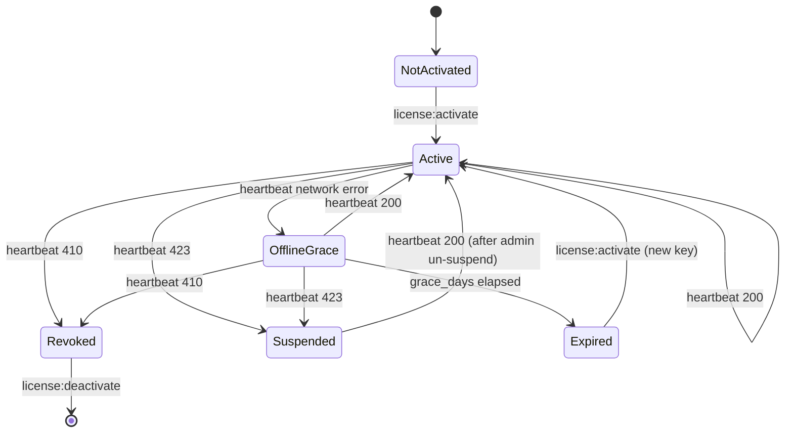

# Offline Grace

How the package behaves when the heartbeat cannot reach the server.

## Default policy

- `offline_grace_days = 7`
- The cached token is honoured for that many days after the most recent successful heartbeat.
- During grace, `License::isValid()` returns true and `License::status()` returns `offline_grace`.
- After grace expires, `License::isValid()` returns false. Routes guarded by `license` middleware return 403.

## State transitions



## Tuning the grace window

Set `G8KEY_OFFLINE_GRACE_DAYS` in `.env` to override. A longer grace is friendlier to flaky networks but extends the
window in which a revoked license keeps working. A shorter grace is stricter.

```env
G8KEY_OFFLINE_GRACE_DAYS=3
```

A grace of `0` is honoured but discouraged — any single network blip drops the product into degraded state.

## What `Revoked` and `Suspended` mean

| Status | Source | Recoverable? |
|--------|--------|--------------|
| `revoked` | Server returned `410 Gone` on heartbeat | No — issue a new license. |
| `suspended` | Server returned `423 Locked` on heartbeat | Yes — once admin un-suspends, next heartbeat returns to `active`. |

Network-error-induced `offline_grace` is not the same as `revoked` / `suspended`; the package will not flip those
without an authoritative response from the server.

## Next Steps

- [Troubleshooting](03-troubleshooting.md)
- [Heartbeat](../03-integration/02-heartbeat.md)
